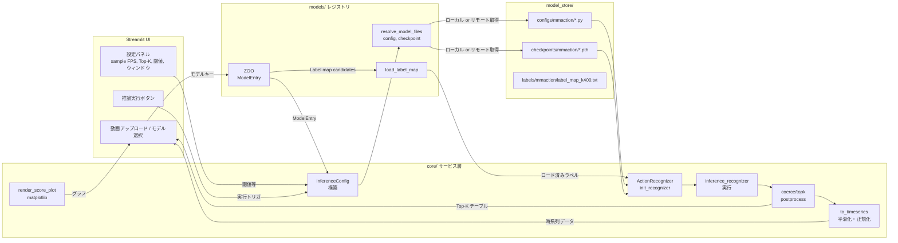

# MMAction2 Streamlit デモ

Streamlit と MMAction2 を組み合わせ、アップロードした動画の行動認識を即座に試せるアプリケーションです。UI からモデル・デバイス・サンプリング設定などを選び、トップKラベルとスコア推移グラフ、動画プレビューを表示します。

## プロジェクト構成

```
app/                 # Streamlit エントリポイントと UI
core/                # 推論ラッパー、前後処理、可視化ユーティリティ
models/              # モデルレジストリとキャッシュ／ダウンロード補助
configs/             # アプリ既定設定 (YAML)
model_store/         # 取得済みの設定ファイル・チェックポイント・ラベル
scripts/             # モデルの一括ダウンロード等のスクリプト
tests/               # pytest によるユニットテスト
```

## アーキテクチャ概要

- **MMAction2 を選択した理由**: OpenMMLab が提供するアクション認識フレームワークで、モデル・データセット・推論APIが統合されており、公式の `inference_recognizer` を利用するだけで学習済みモデルをすぐに利用できます。標準化された設定ファイルとモデル動作の再現性が高く、Streamlit からのラッピングも容易です。
- **TSN (Temporal Segment Networks)**: 軽量な 2D CNN ベースの手法で、動画を複数セグメントに分割して代表フレームを扱うため計算コストが低く、CPU でもリアルタイム推論が可能。デモ用途やプロトタイピングに適しています。
- **SlowFast**: 2 本の時間スケール（低フレームレートの Slow パスと高フレームレートの Fast パス）で時系列情報を捕捉する 3D CNN 系モデル。より高精度で動きに敏感なアクションが識別できる半面、GPU リソースを多く消費します。本アプリでは高精度デモ用モデルとして選択しています。



Streamlit 側は `models/zoo.py` のレジストリを通じてモデル設定を取得し、`core/infer.py` から MMAction2 の推論 API を呼び出します。前処理 (`core/preprocess.py`) と後処理 (`core/postprocess.py`) でフレームサンプリングやスコア平滑化を行い、`core/viz.py` が時系列プロットを生成します。

## セットアップ

```bash
uv venv
source .venv/bin/activate
uv sync
```

主要依存: PyTorch 2.1+, MMAction2 1.1+, MMCV 2.1.x, MMEngine, OpenCV, Streamlit, OpenMIM など。

## モデルアセットの準備

1. 付属スクリプトで `model_store/` にモデル一式を配置します。
   ```bash
   python scripts/download_models.py                  # 登録済みモデルを全て取得
   python scripts/download_models.py tsn_r50_kinetics400  # 単一モデルのみ
   ```
   - `mim download mmaction2 --config <id>` を優先使用し、用意できなければ直接URLから取得します。
   - 取得したファイルは `model_store/configs/mmaction/`（設定）、`model_store/checkpoints/mmaction/`（重み）、`model_store/labels/mmaction/`（Kinetics-400 ラベル）に格納されます。
2. オフライン環境では事前に作成した `model_store/` をコピーするか、`MMACTION2_APP_MODEL_DIR=/path/to/store` を設定して別ディレクトリを指定します。

## アプリの起動

```bash
streamlit run app/ui.py
```

サイドバーでモデル、デバイス、サンプリングFPS、Top-K、しきい値、スムージング幅などを設定できます。推論結果はキャッシュされた認識器を通じて、テーブル・折れ線グラフ・動画プレビューとして表示されます。

## テストとリンティング

```bash
pytest                       # core / preprocess / postprocess / infer のユニットテスト
ruff check .                 # Lint
black .                      # 整形 (line length 100)
```

テストは MMAction2 の API をモック化しているため、GPU や巨大依存を用意しなくても実行できます。

## モデルレジストリの仕組み

`models/zoo.py` では以下を管理しています。
- `model_store/` を指すローカル優先の設定ファイル・チェックポイントパス
- 未取得時のためのバックアップURL
- 表示名・説明・ラベルマップなどのメタデータ
- OpenMIM の config ID（`mim download` で利用）

Streamlit 側ではこのレジストリを参照して推論器を初期化し、`core/` のユーティリティで Top-K 抽出やスコア平滑化、可視化を行います。
